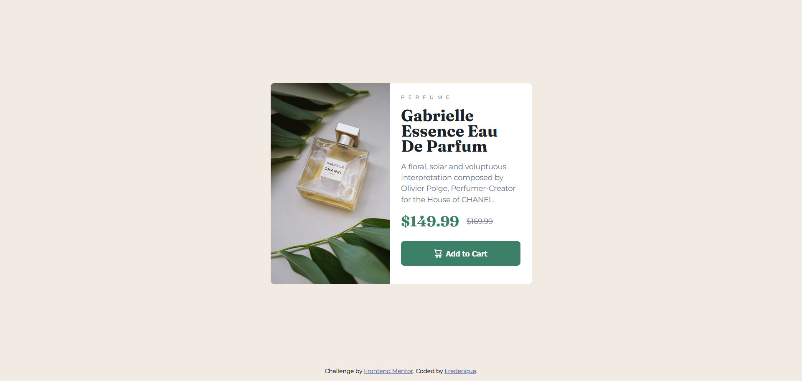
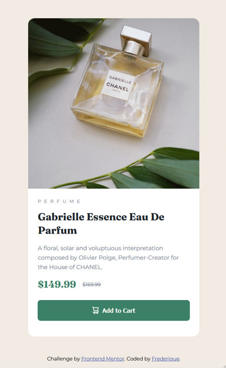

🎯 Frontend Mentor - Défi "Product Preview Card Component"

Bienvenue sur mon projet basé sur le challenge Product preview card component de Frontend Mentor.

Ce challenge m’a permis de mieux comprendre comment adapter un design à tous les écrans. J’ai aussi appris à mieux gérer les images, à utiliser Flexbox et clamp() pour ajuster la taille du texte de façon responsive.

🖼️ Aperçu

Voici un aperçu du résultat final :  
  

🚀 Le défi

- Créer une carte fidèle à la maquette, aussi bien sur mobile que sur desktop
- Centrer l’ensemble proprement avec Flexbox
- Adapter l’affichage selon la taille de l’écran grâce aux media queries
- Utiliser clamp() pour que la taille du texte s’ajuste automatiquement
- Afficher les images sans qu’elles soient déformées, en utilisant object-fit
- Intégrer un bouton avec une icône de panier et des effets au survol

🔗 Liens utiles

- 💻 Code source : [Voir sur GitHub](https://github.com/ton-utilisateur/product-preview-card)
- 🌐 Site en ligne : [Voir le site](https://ton-utilisateur.github.io/product-preview-card/)

🛠️ Technologies utilisées

- HTML5 
- CSS3 (Flexbox, Media Queries)
- "clamp()" pour les tailles de texte adaptatives
- "object-fit" pour les images
- Unités relatives : rem, %, vw pour un rendu fluide

📚 Ce que j’ai appris

- À limiter la hauteur d’une image sans la déformer ("object-fit: cover")
- À manipuler "clamp()" pour éviter l’abus de media queries
- À bien centrer une icône et un texte dans un bouton avec "display: flex"

🔄 Améliorations futures

- Ajouter une petite animation au bouton quand on passe la souris dessus, pour le rendre plus vivant
- Peut-être refaire cette carte plus tard en JavaScript ou React pour la rendre interactive (ex. : ajouter au panier en cliquant)

📘 Ressources utiles

- [MDN - object-fit](https://developer.mozilla.org/fr/docs/Web/CSS/object-fit)
- [Frontend Mentor - Discord](https://discord.gg/frontendmentor)

👤 À propos de moi

Je m'appelle Frédérique et je continue à me former en développement web.

- GitHub : [@ton-utilisateur](https://github.com/ton-utilisateur)
- Frontend Mentor : [@ton-utilisateur](https://www.frontendmentor.io/profile/ton-utilisateur)

🙏 Merci à Frontend Mentor pour ce challenge formateur, simple mais exigeant en détails !
